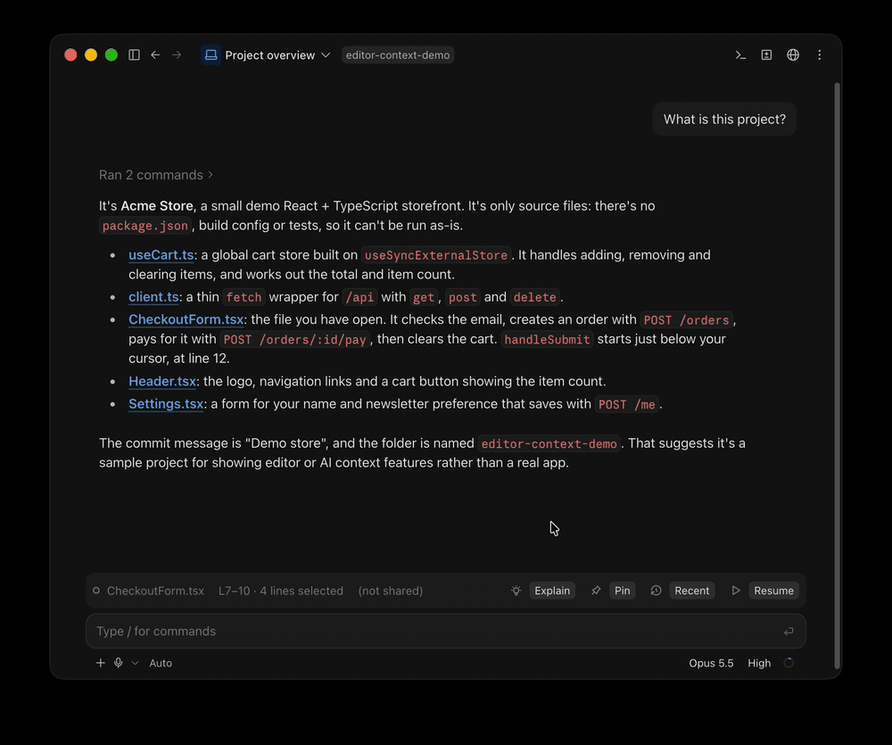

<div align="center">

# editor-context

**Claude always knows what you're looking at in your editor.**

A mod for the Claude desktop app that shows your current Cursor or VS Code file and selection above the prompt, and quietly sends it to Claude with every message.

[](plugins/editor-context/.claude-plugin/plugin.json)
[](LICENSE)
[](https://code.claude.com/docs/en/plugins/mods/overview)

</div>

<p align="center"></p>

## Why

In the terminal, Claude Code already sees your editor selection through `/ide`. The desktop app doesn't. So you end up pasting code and file paths into every message.

With this mod, you just select the code and ask: "why does this fail?" or "explain this".

## Features

👀 **Live file and selection**<br>
The band shows the file, the line range and how many lines are selected. It updates as you click around.

💬 **Sent with every message**<br>
Claude gets the file path and the selected code. It stays out of your chat.

💡 **Explain**<br>
One click asks Claude to explain the selection, or the whole file.

📌 **Pin**<br>
Pin as many selections as you like, from any files. They're attached to every message until you unpin them.

💾 **Unsaved warning**<br>
Tells you (and Claude) when the file has unsaved changes, with a Save button.

🕘 **Recent files**<br>
Your last five files, one click to reopen. Hidden until you press Recent.

⏸️ **Pause**<br>
Stop sharing until you press Resume.

🔌 **Connection notices**<br>
Says when no editor is open or the connection drops.

## Quick start

**1. Install the Claude Code extension in your editor.**
Search for **Claude Code** by Anthropic in the Extensions view, or run:

```bash
cursor --install-extension anthropic.claude-code   # Cursor
code --install-extension anthropic.claude-code     # VS Code
```

**2. Install the mod.** In a Claude Code session:

```
/plugin marketplace add talbarina/claude-editor-context
/plugin install editor-context@talbarina
```

**3. Start a session** in the desktop app, in the same folder you have open in your editor. Send your first message and the band appears.

To preview every part of the band with sample data, run `/editor-context-demo`.

## Requirements

- The Claude desktop app, with Claude Code v2.1.287 or later
- VS Code or Cursor, open, with the Claude Code extension
- Node.js 22 or later
- macOS or Linux

## Good to know

- **No band on the new-session screen.** That screen comes before the session exists, so no mod can draw there. The band appears once the session starts, and your first message still includes your editor context.
- **Desktop app only.** In terminal sessions the mod stays off, because `/ide` already does this there.
- **One editor connection.** Your editor accepts one connection at a time. All your desktop sessions share it, but a terminal session using `/ide` on the same editor will take turns with them.
- **Long selections are cut** at 20,000 characters.

## What Claude sees

Nothing shows in your chat. Claude gets a short note with each message:

```
The user has lines 12-30 of /path/to/project/src/components/CheckoutForm.tsx
selected in Cursor. "This", "here" or "these lines" likely refers to it:
<the selected code>
```

If the selection hasn't changed since your last message, Claude gets a one-line reminder instead of the code again.

## 🔒 Privacy

Everything stays on your machine. The mod reads your editor through the Claude Code extension's local connection and adds it only to messages you send. Press **Pause** whenever you want Claude not to see what's open.

## Troubleshooting

<details>
<summary><b>The band doesn't appear</b></summary>

- Check that the editor is open and the extension is installed: `ls ~/.claude/ide` should list a `.lock` file.
- Run `/plugin` and check that `editor-context` is listed as active.
- Make sure you're in the desktop app, not the terminal.
</details>

<details>
<summary><b>It says "Lost connection"</b></summary>

Another client took the editor's connection, usually a terminal session running `/ide`. The mod reconnects when the editor is free.
</details>

<details>
<summary><b>It says it needs Node.js</b></summary>

Install Node.js 22 or later, then start a new session.
</details>

<details>
<summary><b>It follows the wrong editor window</b></summary>

It picks the window that has your session's folder open. Start the session in that folder, or close the other window.
</details>

## How it works

<details>
<summary>Details</summary>

The Claude Code extension runs a small local server in your editor and records its port in `~/.claude/ide/`. When a desktop session starts, the mod launches a Node helper that connects to that server, listens for selection changes, and checks for unsaved changes every 1.5 seconds.

The editor accepts one client at a time, so the first session's helper holds the connection and the other sessions listen to it over a local socket. When that session closes, another takes over.

To see exactly which events the mod handles and what it calls before you install it:

```bash
git clone https://github.com/talbarina/claude-editor-context
claude plugin validate claude-editor-context/plugins/editor-context
```
</details>

## Update or remove

```bash
claude plugin marketplace update talbarina          # update
claude plugin uninstall editor-context@talbarina    # remove
```

## Credits

Band icons by [Tabler Icons](https://tabler.io/icons) (MIT).

## License

[MIT](LICENSE) © 2026 Tal Barina
